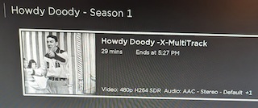

## Tips and Tricks for the Jellyfin Roku Client

## Login

If connecting to a secure server, make sure to include the HTTPS portion when entering a URL.

## Quick Connect

If the server you are connecting to is at least version 10.8, you can use Quick Connect.  This requires you to connect to the server via the Web Client.

1. Connect to server via the Web Client.
2. Select your profile on the Web Client.
3. Select Quick Connect on the Web Client.
4. Select Quick Connect on the Roku client.

5. Enter the Quick Connect code on the Web Client and hit the Authorize button on the Web Client.  If successful, the Quick Connect dialog will close automatically and you will be logged in.

## Search

You can hit the Options ("*") menu item while on the home screen.  This will bring up a search page.  If your Roku supports Voice Search, you should see a small microphone in the search bar.

## Multi Audio Shows

While viewing a list of TV episodes, if a particular TV show has more than one audio track there will be "+" number indicating how many extra audio tracks are available.

Selecting the Option ("*") menu while the TV show is highlighted will bring up a dialog to select the various audio tracks.

## Subtitles while viewing

While viewing a movie or show, you can hit the Down arrow to view available subtitles.  If there are no subtitles available nothing will happen.

## Transcoding Information

While viewing a movie or show, you can view the transcoding and streaming information by hitting the Up arrow.

Note that you can scroll down this list to view any information that didn't fit in the dialog.